# LDTS_l07_g03 - T_Rex_LDTS

## Descrição do projeto:

Trata-se de um projeto que visa clonar (com algumas invenções nossas) o famoso jogo do dinossauro da Google, possível de ser jogado quando o dispositivo não possui uma conexão à Internet. De qualquer modo, é possível jogá-lo com conexão, acedendo a um site como o seguinte: [Clique Aqui](https://dinorunner.com/pt/).

A personagem principal do jogo é um pequeno dinossauro T-Rex, desenhado de forma estilizada, com um corpo robusto e pernas curtas, as quais se mexem através de uma animação. O jogo apresenta um cenário minimalista, mas colorido e vibrante, num ambiente retro, com um fundo despojado que procura uma semelhança a uma floresta da época. Para iniciar o jogo, é necessário escolher a opção desejada no menu (Jogo Single Player ou 2 Player Game). Além disso, é possível também consultar a LeaderBoard ou, naturalmente, sair do jogo.

O jogo baseia-se num dinossauro que tem como movimentos possíveis apenas o salto normal (através da Seta para Cima ou do Espaço) e salto longo (Seta para Baixo) e que tem por objetivo, ultrapassar vários objetos (saltando ou passando por baixo), somando assim o maior número de pontos possível. Dentro dos obstáculos característicos do jogo destacam-se o famoso pterodáctilo e o clássico cacto (que em momentos pode surgir em conjuntos, dificultando a vida do dinossauro).
Uma das implementações que fizemos foi a implementação de powerups (Fire jaw, Explosão e Troféu). A Fire jaw permite destruir obstáculos ao colidir com eles, durante o período marcado na tela. A Explosão, representada por uma FlashBang, destrói todos os obstáculos existentes na tela. Por fim, o Trofeu incrementa 30 pontos a pontuação atual do utilizador. Um jogador pode obter um powerup coletando-os em caixas amarelas que surgem no ar. O seu design relembra as famosas caixas do jogo Super Mário. De destacar que cada jogador pode ter apenas um powerUp de cada vez guardado na “mochila”, podendo ser usado a qualquer momento pressionando a seta para baixo.
O mundo vai-se movendo da direita para esquerda, transmitindo ao utilizador a ilusão de que a personagem possuí movimento a duas dimensões. Com o passar do tempo, a fim de alcançar um aumento gradual da dificuldade, o mundo deslizará cada vez mais rápido.O jogo possui um sistema de contabilização de pontuação e de níveis, sendo que este último vai condicionando a dificuldade evidenciada no jogo.
O jogo não possui um final, alcançável a partir de uma pontuação ou distância percorrida. Trata-se de um mundo que desliza indefinidamente, terminando apenas quando existe uma colisão entre o dinossauro e um dos obstáculos mencionados. A pontuação nesse instante será a pontuação final. Após o seu fim, surge a mensagem “GAME OVER” e convida-se o utilizador a dar 3 letras que permitirão identificá-lo na leaderboard. Após isto, será possível reiniciar o jogo.

Em síntese, trata-se de um jogo simples, mas extremamente cativante, o que fez com que ao longo dos anos a sua versão original se tornasse um “passatempo” popular para quando os utilizadores não possuem uma conexão estável à Internet.
## Lista de Features

Apresenta-se de seguida a lista que enumera as features que implementámos ou que temos por intenção implementar no projeto que estamos a desenvolver. Destaca-se uma forte componente enraizada no jogo que anteriormente descrevemos, tendo, no entanto, tido por objetivo, o seu aprimoramento:

- **Menu**: Permite ao utilizador selecionar uma das seguintes opções (serão de seguida melhor explicadas em pormenor): Iniciar um jogo Single-Player, iniciar um jogo de 2 Jogadores, ver a LeaderBoard, Sair do jogo.
- **Single-Player**: Modo de jogo com um jogador, que simula o famoso jogo do Dinossauro, com algumas alterações que implementamos (consultar pontos seguintes), nomeadamente uma contagem por níveis que determina a progressão da dificuldade e a existência de powerUPs.
- **Modo 2 Jogadores**: Modo de Jogo que permite competição entre dois utilizadores num mesmo computador, tendo cada um comando de teclas diferentes. Ganha um jogador, quando o outro colidir com um obstáculo. Além disso, também está presente neste modo 2 dos powerups (Fire Jaw e explosão).
- **Leaderboard**: Permite guardar o top 6 melhores resultados alcançados no modo Single Player, sendo registado um nome (3 letras) e a pontuação alcançado. Tais dados serão guardados num ficheiro .txt acessível através de uma única instância da classe Leaderboard.
- **Obstáculos** - Cacto e Pterodáctilo: Obstáculos estáticos que, quando detetam uma colisão por parte do dinossauro, marcam o fim do jogo.
- **Caixas**: Elementos de jogo que permitem ao utilizador receber um powerUP aleatório. Naturalmente, uma colisão com eles não provoca o fim do jogo. Os powerUps disponíveis são: a Fire jaw permite destruir obstáculos ao colidir com eles, durante o período marcado na tela; a Explosão, representada por uma FlashBang, destrói todos os obstáculos existentes na tela; o Trofeu incrementa 30 pontos a pontuação atual do utilizador.
- **PowerUPs**: Coletados nas caixas. Um utilizador pode acumular no máximo um powerUP não utilizado. Ao coletar um novo, se ainda existir algum guardado, esse mesmo é eliminado. O uso de um powerUP permite ao utilizador obter diferentes benefícios como destruição de obstáculos seguintes e pontos extra, como pormenorizado anteriormente.
- **Salto Longo**: Permite ao dinossauro ultrapassar objetos maiores (sequência de cactos, por exemplo. Efetivamente várias células em vez de uma), que não seria possível com o salto comum. É importante mencionar que esta feature não torna redundante o salto normal, já que o utilizador é obrigado a planear onde aterra.
- **Contador de pontos**: A cada obstáculo ultrapassado no modo Single-Player, o utilizador será recompensado com pontos. A obtenção de uma pontuação elevada conduzirá à sua inserção na leaderboard.
- **Contador de níveis**: Condiciona o progresso na dificuldade do jogo. Evolui infinitamente, sendo que o aumento de dificuldade termina quando o nível 5 é alcançado. Uma subida de nivel implica que o mundo ande mais rápido, mais obstáculos e menos powerups.
## Features Planeadas
Todas as features foram implementadas.

## Mockups:
-Menu:

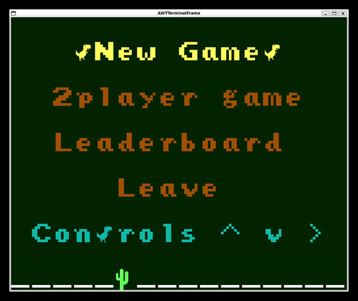

-Fire jaw:

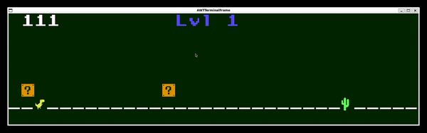

-Bomb:

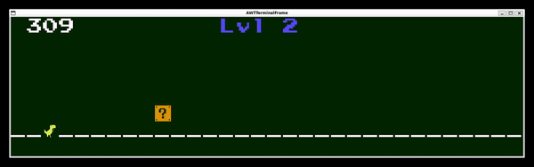

-Points:

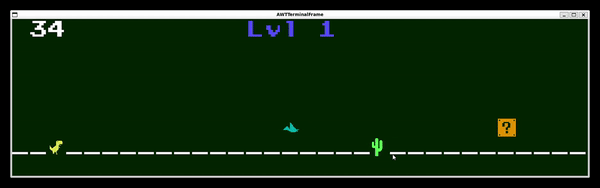

SinglePlayer e TwoPlayer Game Over:

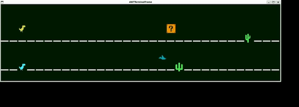

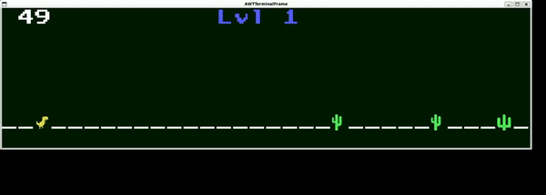

-TwoPlayer:

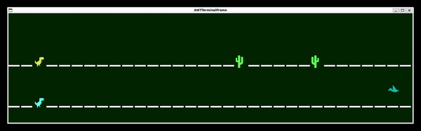

-Leaderboard:

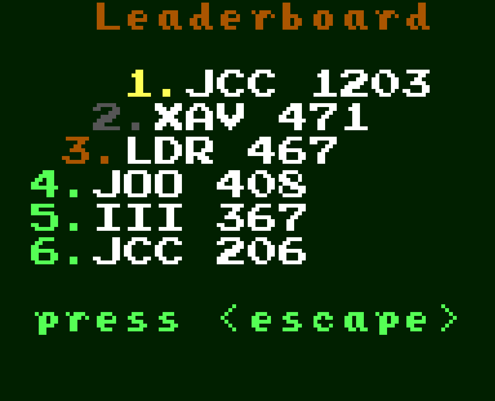

## UML
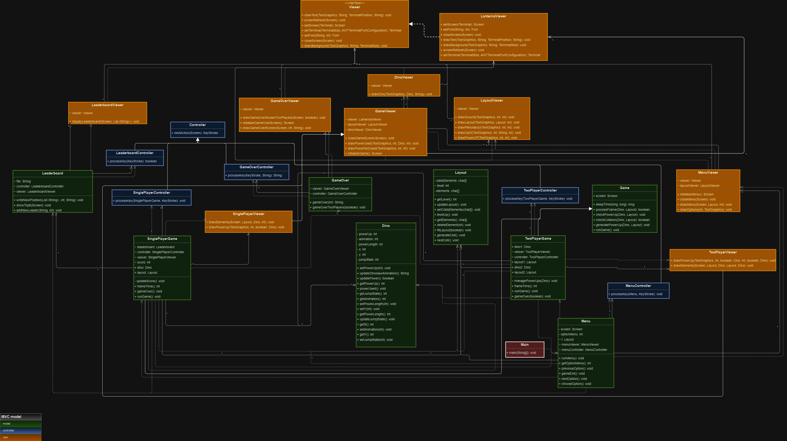

## Design
Para o desenvolvimento deste projeto recorremos ao padrão arquitetural MVC, procurando obter uma divisão lógica das diferentes componentes do jogo, mantendo-o organizado. O MVC divide o código em três partes: view, responsável pela interface visual apresentada ao jogador, controller, responsável por controlar as interações que o jogador tem com a view (através de ações no teclado neste caso), e model, responsável por fazer a ponte entre o controller e a view, onde estão todos os dados e toda a lógica do jogo. É a combinação destas três componentes que constrói o jogo que aqui apresentamos.

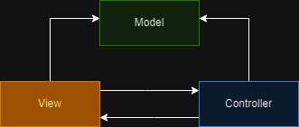

A organização do código é uma componente importante de qualquer projeto, e o uso deste padrão arquitetural tem exatamente como objetivo facilitar futuras alterações ao código ou expansões do mesmo, até porque divide estas três componentes, tornando-as independentes a mudanças feitas em qualquer uma das outras.

### Design Patterns
### Facade
#### Problema no Contexto:
As classes Viewer e LanternaViewer no nosso projeto são responsáveis por lidar com os aspetos gráficos da interface do jogo, incluíndo configuração de fontes, configuração de terminais, preenchimento do fundo de um ecrã com uma cor específica ou escrita de texto no foreground, inicialização de um ecrã, refresh de um ecrã e encerramento do mesmo. À medida que o projeto avançava, tornou-se evidente a necessidade de uma interface simplificada e unificada para interagir com todas as classes que recorriam a alguma destas funcionalidades. O objetivo era encapsular as complexidades da implementação das especificidades da nossa GUI library, o Lanterna, e fornecer, portanto, uma interface mais direta e coesa para todo o projeto.

#### O Padrão:
Para resolver este problema, evidentemente aplicámos o padrão de design Facade. O padrão Facade fornece uma interface unificada para um conjunto de interfaces num subsistema, simplificando o uso desse mesmo subsistema, permitindo, então, evitar que as restantes classes tenham consciência das especificidades do Lanterna, o que, por sua vez, facilita uma futura alteração do código. No nosso caso, a interface Viewer atua como a fachada, abstraindo as complexidades da renderização gráfica e fornecendo um conjunto simplificado de métodos para todo o projeto.

#### Implementação:
A interface Viewer define um conjunto de métodos que representam as ações necessárias para a renderização gráfica do nosso jogo. A classe LanternaViewer, que implementa a interface Viewer, encapsula os detalhes concretos da implementação destes mesmos métodos, como a interação com a biblioteca Lanterna para preencher fundos de ecrã, escrever texto ou gerir o próprio ecrã.

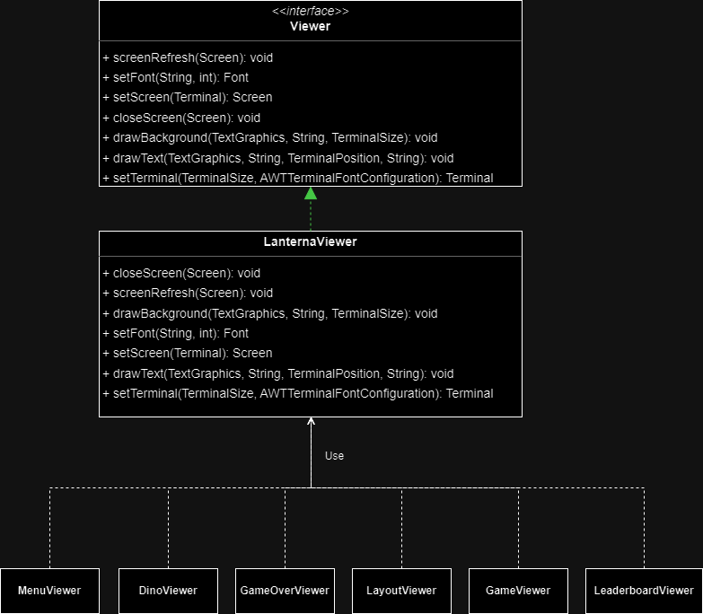

#### Consequências:
Em suma, a adoção do padrão Facade no design das classes de visualização resultou numa interface simplificada de alto nível, facilmente legível, flexível, manutenível e que protege as restantes classes do projeto de uma complexidade desnecessária.

### Strategy

#### Problema no Contexto:
As classes SinglePlayerGame e TwoPlayerGame no nosso projeto são responsáveis por gerir os dois modos de jogo (para um ou dois jogadores, naturalmente) que decidimos implementar. Estas classes lidam com várias funcionalidades comuns aos dois modos de jogo, que vão desde a definição da framerate à gestão de colisões e geração de powerups. Conforme o projeto evoluía, identificámos a necessidade de reduzir a duplicação de código proveniente destas duas classes, devido à similaridade de alguns métodos.
#### O Padrão:
Implementámos, assim, o padrão de design Strategy no design destas classes do jogo. O padrão Strategy agrupa um conjunto de algoritmos comuns às classes que o usam, o que permite que o programa escolha um desses algoritmos em tempo de execução. No nosso cenário, além dos algoritmos em comum, as classes SinglePlayerGame e TwoPlayerGame utilizam ambas o método runGame, mas implementam-no de maneira diferente. A escolha deste padrão de design facilita a extensão e modificação do comportamento do jogo propriamente dito.
#### Implementação:
Ambas as classes de jogo partilham uma interface comum, Game, que declara os métodos essenciais para a execução do jogo e para o tratamento das condições de fim de jogo. As especificidades da execução do jogo de um ou dois jogadores são, assim, implementadas nas classes SinglePlayerGame e TwoPlayerGame, respetivamente.

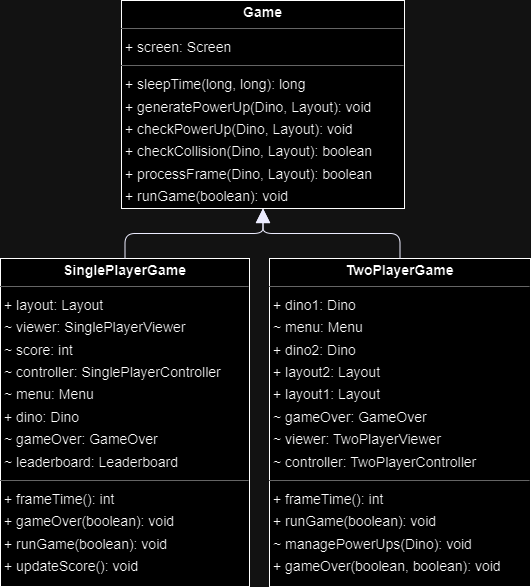

#### Consequências:
A aplicação do padrão Strategy no design das classes de jogo melhorou a flexibilidade e a facilidade de leitura do nosso código. Este padrão permite uma fácil adaptação a diferentes modos de jogo, promovendo uma estrutura de código limpa e expansível. Este padrão ajudou ainda na eliminação de code smells que poderiam originar da eventual repetição de código nas duas classes.
## Code Smells

Durante o desenvolvimento do projeto procurámos reduzir o número de code smells presentes no código, recorrendo à herança de classes, ao uso de design patterns e à divisão de métodos que acabaram por ficar mais extensos que o desejado. Apesar destas medidas para evitar código repetido ou de difícil leitura, há ainda um método na classe model.elements.Layout que resultou num code smell devido ao tamanho do mesmo e à inerente dificuldade em desconstruir e entender o que faz. O método generateCell() tem como função gerar o próximo obstáculo que vai aparecer no caminho do utilizador, no entanto, o processo de geração tem várias regras que têm como objetivo impedir a criação de um obstáculo impossível de ultrapassar (nomeadamente, é evitada a existência de três catos consecutivos, de um elemento voador imediatamente antes ou após um cato, entre outras situações). Assim, a existência de todas estas condições levou a um conjunto de instruções if, else if e else que podem originar alguma confusão aquando da leitura deste método. Apesar de termos identificado este code smell relativamente cedo no desenvolvimento do jogo, as alternativas que encontrámos envolviam uma perda da aleatoriedade na geração de novos obstáculos, uma duplicação de código desnecessária, resultavam numa classe demasiado longa, ou envolviam uma perda na flexibilidade do código, que levaria a uma maior dificuldade na sua alteração e expansão, pelo que decidimos optar por esta implementação.

## Testing

### Pitest

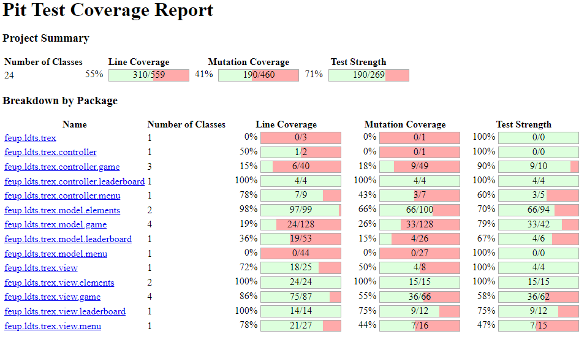

### Jacoco

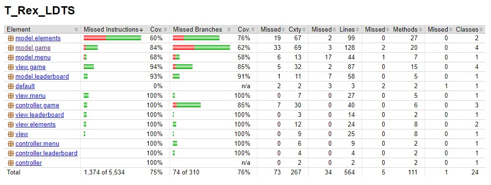

## Desenvolvido por:
- Xavier Guimarães (up202206062) - 33,3%
- João Pedro Castro (up202206575) - 33,3%
- João Pedro Sousa (up202207285) - 33,3%
- 
## Fontes de Inspiração:
 No desenvolvimento deste projeto, usámos como inspiração na conceptualização de alguns elementos trabalhos desenvolvidos nas aulas práticas e outros feitos por antigos alunos, destacando:
 
 -Projeto 'hero' (desenvolvido nas aulas)
 
 -Projeto 'Flappy_Tiger': [link](https://github.com/thePeras/LDTS_Flappy_Tiger)
 
 -Projeto 'Supaplex': [link](https://github.com/Fabio-A-Sa/Y2S1-LabTesteSoftware/tree/main/Project)
